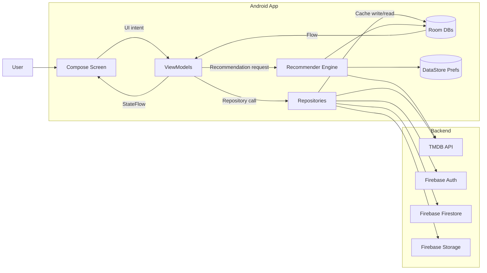
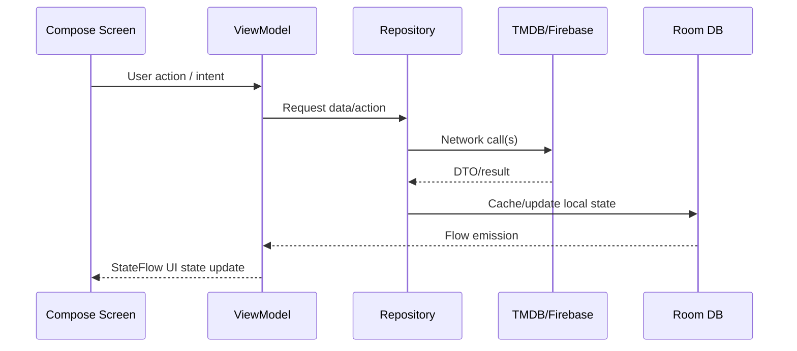
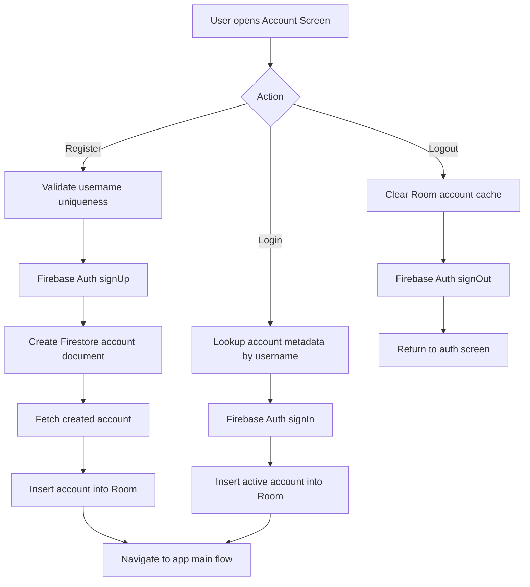
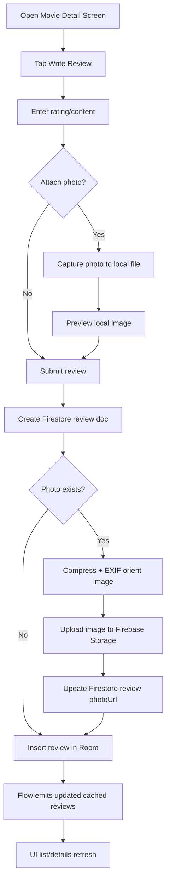
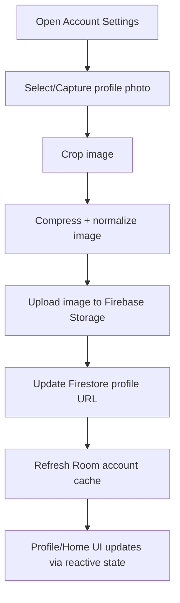
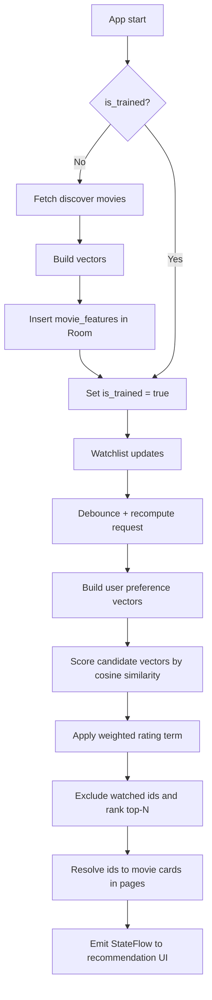

# CSD3156 Team Project Report
>
> **Project Title:** Movie Review App  
> **Team Number:** 28
> **Team Members:**
> Halis Ilyasa Bin Amat Sarijan (2301333)
> Yeo Jia Hao (2301329)
> Neo Hui Zong (2301357)
> Tan Yee Tong (2301414)
> Joel Lee Jie (2301419)
> **Module:** CSD3156 Mobile and Cloud Computing  
> **Date:** 23/02/2026

## 1. Project Summary

### Project Links

**Github Project Link** : <https://github.com/Silver1713/csd3136-mobile-project>
**Application Demo Link**: <https://your_link_here>
**Video Presentation Link**: <https://your_link_here>

### Project Goal

Build an Android movie application that combines discovery, personal reviews, watchlist management, and personalized recommendations in a single experience.

### Project Outcome

The app supports authentication, browse/search/discover, movie details, review writing with optional photo upload, watchlist sync, profile/settings, and recommendation surfaces.

### Key Technical Highlight

MVVM + Repository architecture with Hilt DI, TMDB + Firebase integrations, Room local cache, and a content-based recommendation engine backed by its own Room database.

### Key User Value

Users can discover movies quickly, track what they want to watch, and receive recommendations based on their own preferences.

## 2. Problem Statement and Objectives

### Problem Statement

Movie fans often use separate apps for discovery, personal note-taking, and watch tracking, which creates fragmented workflows and weak personalization.

### Target Users

Mobile users who want one app for movie discovery, personal reviews, watchlist tracking, and recommendation support.

### Objectives

1. Deliver complete core movie app flows on Android: auth, discovery, details, reviews, watchlist, and profile management.
2. Implement a maintainable architecture with clear separation of concerns and reactive UI updates.
3. Add a recommendation module that can train locally and produce personalized ranked movie candidates.

## 3. Final Product Scope

### Key Features

1. Authentication and account lifecycle via Firebase Auth + Firestore with Room cache.
2. Home browse surfaces with popular/trending/discover/search flows and pagination.
3. Movie details with videos/providers/reviews and local + remote review aggregation.
4. Review creation with optional photo capture/compression/upload to Firebase Storage.
5. Watchlist add/remove/sync with Room + Firestore.
6. Recommendation row and extended list powered by `RecommenderViewModel`.

## 4. Software Architecture and Design

### Architecture Pattern

MVVM + Repository + Hilt dependency injection.

### Major Components

1. UI layer: Jetpack Compose screens and feature ViewModels (`HomeScreenViewModel`, `MovieListViewModel`, `RecommenderViewModel`, etc.).
2. Domain layer: Domain models and repository interfaces for clean boundaries.
3. Data layer: Repository implementations coordinating TMDB, Firebase services, and Room local persistence.

### External Services

1. TMDB API for movie metadata, discovery, details, providers, videos, and external reviews.
2. Firebase Auth/Firestore/Storage for account identity, app-owned data, and image media.
3. Room + DataStore for local caching, reactive flows, and recommender metadata/state.

### Design Rationale

1. Repository boundaries isolate remote/local concerns and reduce direct SDK coupling in UI code.
2. Room + Flow provide local-first responsiveness and automatic UI refresh on data changes.
3. Recommender is isolated in its own module/database to keep ML-specific logic decoupled from general feature repositories.

### 4.1 Component Responsibility Matrix

| Layer/Component | Responsibility | Input | Output |
|---|---|---|---|
| Compose Screens | Render UI, collect state, trigger user actions | `StateFlow`/`Flow` state + UI events | ViewModel intents |
| ViewModels | Orchestrate feature state, loading/error handling, pagination | UI intents + repository calls | UI state updates |
| Repositories | Coordinate remote/local data access and mapping | API/service/DAO calls | Domain model streams and results |
| DTOs | Represent external payload contracts and map transport data to internal models | TMDB/Firebase response/request payloads | Structured transfer objects for repository mapping |
| DI Modules | Provide and scope app dependencies using Hilt | Concrete implementations/configuration objects | Injected services, repositories, DAOs, and ViewModel dependencies |
| Remote Services | Wrap TMDB/Firebase SDK calls | Repository requests | DTOs / request results |
| Room DAOs | Persist/query local cache and emit reactive streams | Repository write/read operations | Local entity streams |
| Recommender Module | Train vectors and compute ranked candidates | Watchlist-derived movie set + trained features | Ranked movie id list |

### 4.2 Feature-to-Screen-ViewModel-Data Mapping

| Feature Area | Primary Screens | ViewModel(s) | Main Data Sources |
|---|---|---|---|
| Home sections | `HomeScreen`, `MovieExtendedList` | `HomeScreenViewModel`, `MovieExtendedListViewModel` | TMDB |
| Movie details + write review | `MovieDetailScreen` | `MovieListViewModel` | TMDB + Room + Firebase |
| Reviews pages | `MovieReviewsScreen`, `ReviewDetailsScreen`, `ReviewList` | `MovieReviewsViewModel`, `ReviewDetailsViewModel`, `ReviewListViewModel` | TMDB + Room + Firestore |
| Search/Browse | `BrowseScreen` | `browseMovieViewModel` | TMDB |
| Watchlist | `WatchlistScreen` | `WatchlistViewModel` | Room + Firestore |
| Account auth | `AccountScreen` | `AccountViewModel` | Firebase + Room |
| Profile + settings | `ProfileScreen`, `AccountSettings` | `ProfileViewModel`, `AccountSettingViewModel` | Room + Firestore + Storage |
| Recommendations | `HomeScreen`, `MovieExtendedList` (`MOVIE_RECOMMENDED`) | `RecommenderViewModel` | Recommender Room DB + watchlist Room + TMDB |

### 4.3 Data and State Contracts

#### UI State Contract

1. Feature screens consume state from ViewModel `StateFlow`.
2. Loading, success, and error states are explicit to avoid ambiguous UI behavior.
3. Paged screens maintain cursor/end/loading flags separately per content type.

#### Repository Contract

1. UI never calls TMDB/Firebase/Room APIs directly.
2. DTO-to-domain mapping happens before data reaches UI layer.
3. Local caches are the source of truth for immediate rendering after write operations.

#### Persistence Contract

1. General app data persists in `MovieReviewDatabase` tables: `accounts`, `movie_reviews`, `watchlist_movies`.
2. Recommendation feature vectors persist in `RecommenderDatabase` table: `movie_features`.
3. Recommender metadata (`is_trained`, vocabulary set) persists in DataStore.

### 4.4 Reliability and Failure Handling Strategy

#### Network Volatility Handling

1. App surfaces loading and error state rather than blocking UI.
2. Local Room cache provides continuity when remote calls are delayed.

#### Consistency Handling

1. Remote writes are followed by local cache updates/refresh to converge state.
2. Watchlist/review/profile flows are designed for eventual consistency between Firebase and Room.

#### Recommendation-Specific Safeguards

1. Recommender reads vectors in DB pages to reduce memory pressure during scoring.
2. Versioned recommendation jobs in ViewModel prevent stale async updates overwriting fresh state.

## 5. Technical and Implementation Details

### Core Tech Stack

| Area | Technologies |
|---|---|
| Language | Kotlin |
| Concurrency and Reactive State | Coroutines, Flow, StateFlow |
| UI | Jetpack Compose |
| Architecture and DI | MVVM, Repository pattern, Hilt |
| Networking | Retrofit, OkHttp, Moshi |
| Local Persistence | Room, DataStore |
| Cloud Services | Firebase Auth, Firebase Firestore, Firebase Storage |
| Media and Image Handling | Coil, uCrop |
| Recommendation and ML | MediaPipe Tasks Text, EJML |

### Dependency Versions (Key)

| Category | Dependency | Version |
|---|---|---|
| Core | `androidx.core:core-ktx` | `1.17.0` |
| Core | `androidx.lifecycle:lifecycle-runtime-ktx` | `2.10.0` |
| Compose | Compose BOM | `2026.02.00` |
| Compose | `androidx.compose.material3:material3` | `1.5.0-alpha14` |
| Navigation | `androidx.navigation:navigation-compose` | `2.9.7` |
| DI | `com.google.dagger:hilt-android` | `2.59.1` |
| Networking | `com.squareup.retrofit2:retrofit` | `3.0.0` |
| Networking | `com.squareup.okhttp3:logging-interceptor` | `5.3.2` |
| Persistence | `androidx.room:room-runtime` | `2.8.4` |
| Persistence | `androidx.room:room-ktx` | `2.8.4` |
| Backend | Firebase BOM | `34.9.0` |
| ML | `com.google.mediapipe:tasks-text` | `0.10.29` |
| ML | `org.ejml:ejml-simple` | `0.41` |

### Data Flow Summary

`Screen -> ViewModel -> Repository -> TMDB/Firebase/Room -> Flow/StateFlow -> Screen`.

### Key Implementation Pipelines

1. Authentication flow: Username lookup and Firebase auth operations are synchronized with local Room account cache to stabilize app state transitions.
2. Review/media flow: Review document creation and image upload are staged, then local Room review cache is updated for immediate rendering.
3. Watchlist flow: Watchlist updates write through Firestore and local Room, with refresh sync from remote source into local state.
4. Pagination/state flow: Multiple list surfaces maintain page/end/loading state, deduplicate by movie id, and expose predictable loading/error semantics.

### Engineering Tradeoffs

1. Local cache prioritizes UI responsiveness and continuity but requires explicit sync/refresh paths with remote state.
2. Recommendation quality was prioritized over full lifecycle sophistication, resulting in startup-triggered background training as a practical first version.

### 5.1 Authentication and Account Pipeline

#### Registration Flow

1. Validate username uniqueness.
2. Create Firebase auth identity.
3. Create account profile record in Firestore.
4. Persist active account in Room for local session continuity.

#### Login Flow

1. Resolve username metadata.
2. Authenticate with Firebase.
3. Refresh local account row.

#### Logout Flow

1. Clear local active-account cache.
2. End Firebase auth session.

### 5.2 Review and Media Upload Pipeline

1. User submits review content (rating/text and optional image path).
2. Create review document in Firestore first to obtain canonical review id.
3. If image exists, compress/orient locally, upload binary to Firebase Storage.
4. Patch review document with uploaded image URL.
5. Persist finalized review in Room so UI updates immediately through reactive local stream.

### 5.3 Watchlist and Synchronization Pipeline

1. Add/remove operations write through Firestore and local Room.
2. Refresh operation pulls authoritative remote watchlist and rewrites local watchlist cache.
3. Watchlist stream acts as trigger source for recommendation recomputation.

### 5.4 Pagination and UI State Management

1. Popular, trending, discover, search, and recommendation surfaces maintain independent pagination state.
2. Incremental loads deduplicate incoming movies by id to avoid duplicate cards after refresh/load-more.
3. Each surface tracks initial loading, load-more loading, and end-of-list conditions separately.
4. Recommendation surface uses id-first ranking, then resolves and emits movie details in pages.

### 5.5 Reactive Streams Usage Across Features

1. Room DAOs expose `Flow` streams for account/review/watchlist data so local updates propagate automatically.
2. ViewModels transform repository streams into screen-facing `StateFlow` models for Compose rendering.
3. Recommendation updates use watchlist stream observation with debounce and version-guarded async updates to avoid stale UI writes.
4. Error/loading transitions are represented in reactive state rather than imperative UI callbacks.

### 5.6 Remote Integrations

#### TMDB Integration

1. Provides popular/trending/discover/search movie lists.
2. Provides movie details, providers, videos, and external reviews.
3. Used as primary public movie metadata source across browse/detail surfaces.

#### Firebase Integration

1. Auth manages user sign-up/sign-in/sign-out identity lifecycle.
2. Firestore stores app-owned account, review, and watchlist documents.
3. Storage stores binary media for profile and review images.
4. Remote writes are synchronized to Room cache for responsive local rendering.

## 6. Recommendation/ML Module

### Objective

Produce personalized movie suggestions from each user’s existing in-app behavior.

### Approach

Content-based recommendation with cosine similarity scoring.

### Features/Signals Used

1. Text embedding from movie overview (`universal_sentence_encoder.tflite` via MediaPipe Text Embedder).
2. Categorical vector from genres, language, adult flag, and release-era tokens.
3. Weighted rating adjustment from vote count and rating metadata.

### Training Lifecycle

On app startup, `MainActivity` checks `is_trained` and runs `EasyTrainModel()` when needed; vectors are generated and persisted to `movie_features` in `RecommenderDatabase`.

### Inference Lifecycle

`RecommenderViewModel` observes watchlist changes, recomputes ranked ids with `Recommender.GetRecommendations(...)`, and pages full movie cards to UI.

### 6.1 Training Method

1. Startup check uses DataStore `is_trained` flag.
2. If untrained, fetch discover dataset (target around 4000 movies).
3. Build vocabulary for category-vector consistency.
4. Clear and rebuild `movie_features` rows in batches.
5. Mark trained state true only after successful insert pipeline.

### 6.2 Feature Construction Method

#### Text Vector

1. Preprocess overview text.
2. Run through MediaPipe text embedder (`universal_sentence_encoder.tflite`).

#### Category Vector

1. Generate tokens from genre, language, adult flag, and release-era bucket.
2. Apply configurable repeat weighting.
3. Fill stable sorted vocabulary map to produce fixed-dimension vectors.

### 6.3 Ranking Method

1. Build user preference vectors from watchlist movies (reuse stored vectors when available).
2. Normalize user vectors and stream candidate movies in pages from Room.
3. Compute cosine similarity for text and category matrices.
4. Combine similarities using configured feature weights.
5. Multiply by vote-aware weighted rating term.
6. Exclude already watched movies and keep top-N results via priority queue.

### 6.4 Runtime Integration Method

1. `RecommenderViewModel` observes watchlist with debounce.
2. Recompute recommendation ids using background dispatcher.
3. Resolve ids to full movie details in pages (`RECOMMENDATION_PAGE_SIZE = 12`, max 60 ids).
4. Publish loading and completion flags for row/grid UI surfaces.

## 7. UI/UX Design

### Design Goals

1. Keep key movie actions reachable with short navigation paths.
2. Maintain consistent loading/error feedback across feature surfaces.
3. Preserve responsive behavior via local caching and reactive state.

### Main User Journeys

1. Login/register -> home browse -> detail inspection.
2. Detail page -> create review (optional media) -> local/remote review visibility.
3. Save watchlist entries -> recommendation row and extended list updates.

### Usability/HCI Considerations

1. Empty-state and loading-state messaging guide users when no data is available yet.
2. Paged loading reduces visual stutter and avoids long blocking waits.
3. Local-first review/watchlist rendering improves perceived responsiveness under unstable network conditions.

## 8. Engineering Process and Team Contributions

### 8.1 Development Process

#### Planning Approach

Feature-first planning with parallel module ownership (auth, movie browsing/details, reviews/media, watchlist, recommendation).

#### Iteration Model

1. Define feature scope and acceptance criteria per module.
2. Implement and integrate one module at a time against shared architecture rules.
3. Run end-to-end scenario checks after each integration cycle.

#### Workflow Controls

1. Maintain separation of concerns (`UI -> ViewModel -> Repository -> Data source`).
2. Keep remote/local operations inside repositories and services only.
3. Preserve consistent state contract (`loading/success/error`) across features.

#### Quality Process

1. Scenario-based manual validation for each major use case.
2. Regression pass after integration of high-impact modules.
3. Bug-fix loop focused on data consistency and UI-state correctness.

### 8.2 Team Contributions

The team contributions are summarized below based on implemented modules and integration ownership.

| Team Member | Primary Areas | Key Deliverables |
|---|---|---|
| Neo Hui Zong (2301357) | Movie details and reviews | Implemented TMDB networking for detail/review data, built movie detail and extended review screens, developed review + media pipelines, integrated Room for review persistence, and implemented related ViewModels/DTO mappings. |
| Tan Yee Tong (2301414) | Watchlist and profile management | Implemented watchlist feature end-to-end, built profile screen and ViewModel, integrated Room persistence for watchlist/profile state, and implemented profile image update media flow. |
| Halis Ilyasa Bin Amat Sarijan (2301333) | Account authentication and account storage | Implemented Firebase authentication flows (sign-up/sign-in/sign-out), handled account validation/login cases, and integrated Room + Firebase for account data lifecycle management. |
| Yeo Jia Hao (2301329) | Home surfaces and remote data services | Implemented home and extended list screens with pagination, built related ViewModels, and developed Firebase service wrappers that handle sending and retrieving app data from remote storage, with DTO/domain mapping for app compatibility. |
| Joel Lee Jie (2301419) | Recommendation pipeline | Designed and implemented the end-to-end recommendation module, including feature generation, training/inference flow integration, and ranked recommendation output for UI consumption. |

## 9. Conclusion

### Final Achievements

The team delivered a full-featured mobile movie app with integrated cloud services, local persistence, and a working recommendation module.

### Key Technical Learning

Clear architectural boundaries, reactive state handling, and staged remote-to-local data pipelines are critical for reliability and maintainability.

## 10. References

1. Android app architecture guide: <https://developer.android.com/jetpack/guide>
2. Android architecture recommendations: <https://developer.android.com/topic/architecture/recommendations>
3. Room persistence documentation: <https://developer.android.com/training/data-storage/room>
4. Firebase Android docs (Auth/Firestore/Storage): <https://firebase.google.com/docs/android/setup>
5. TMDB developer documentation: <https://developer.themoviedb.org/docs>

## 11. AI Usage Declaration

### 11.1 AI Tools Used

1. OpenAI ChatGPT/Codex (writing and technical documentation support).

### 11.2 How AI Was Used

#### Implementation and Documentation Support

1. Used to help summarize existing implementation details from the codebase (especially recommender, Room, Firebase integration, and ViewModel flow).
2. Used to rewrite technical explanations into concise report language after manual verification against source files.
3. Used to improve report structure, section wording, and flow-chart explanations.

#### Report Writing Support

1. Used for grammar correction, wording cleanup, formatting consistency, and section reorganization.
2. Used to rewrite contribution wording for clarity and consistency.

### 11.3 Prompt Summary

AI prompts mainly focused on clarifying recommender architecture and flow from source files, improving report structure and section wording, and refining contribution wording. During development, AI prompts were also used to understand relevant services and frameworks, including Firebase and Hilt.

### 11.4 Responsibility and Verification

1. All final technical content was verified by the team against the actual codebase before submission.
2. AI output was used as drafting and comprehension support only; final decisions and submitted content remain team-owned.

## Appendix A: Architecture Diagram

## Appendix B: Key Data Flow Diagram

## Appendix C: Database Schema Summary

### MovieReviewDatabase Schema

| Table | Key Columns | Purpose |
|---|---|---|
| `accounts` | `id` (PK), `uid`, `username`, `email`, `name`, `profileUrl`, `bio` | Stores active/local account profile data used by auth/profile surfaces |
| `movie_reviews` | `id` (PK), `movieId`, `author`, `content`, `rating`, `createdAtMillis`, `photoPath`, `reviewId`, `userId` | Stores app review records for local-first review rendering and sync support |
| `watchlist_movies` | `movieId` (PK), `title`, `posterUrl`, `releaseDate`, `rating`, `savedAt`, `firstGenres` | Stores user watchlist snapshot for watchlist UI and recommendation trigger source |

### RecommenderDatabase Schema

| Table | Key Columns | Purpose |
|---|---|---|
| `movie_features` | `id` (PK), `rating`, `voteCount`, `overviewTagVector`, `categoryVector` | Stores trained feature vectors and score metadata used during recommendation ranking |

### Recommender Metadata (DataStore)

| Key | Type | Purpose |
|---|---|---|
| `is_trained` | Boolean | Tracks whether recommender training has been completed |
| `vocabulary` | Set\<String\> | Stores category vocabulary to keep category vector dimensions stable |

## Appendix D: Account Flow Chart

## Appendix E: Review and Media Flow Chart

## Appendix F: Profile Photo Update Flow Chart

## Appendix G: Recommendation Runtime Flow Chart

