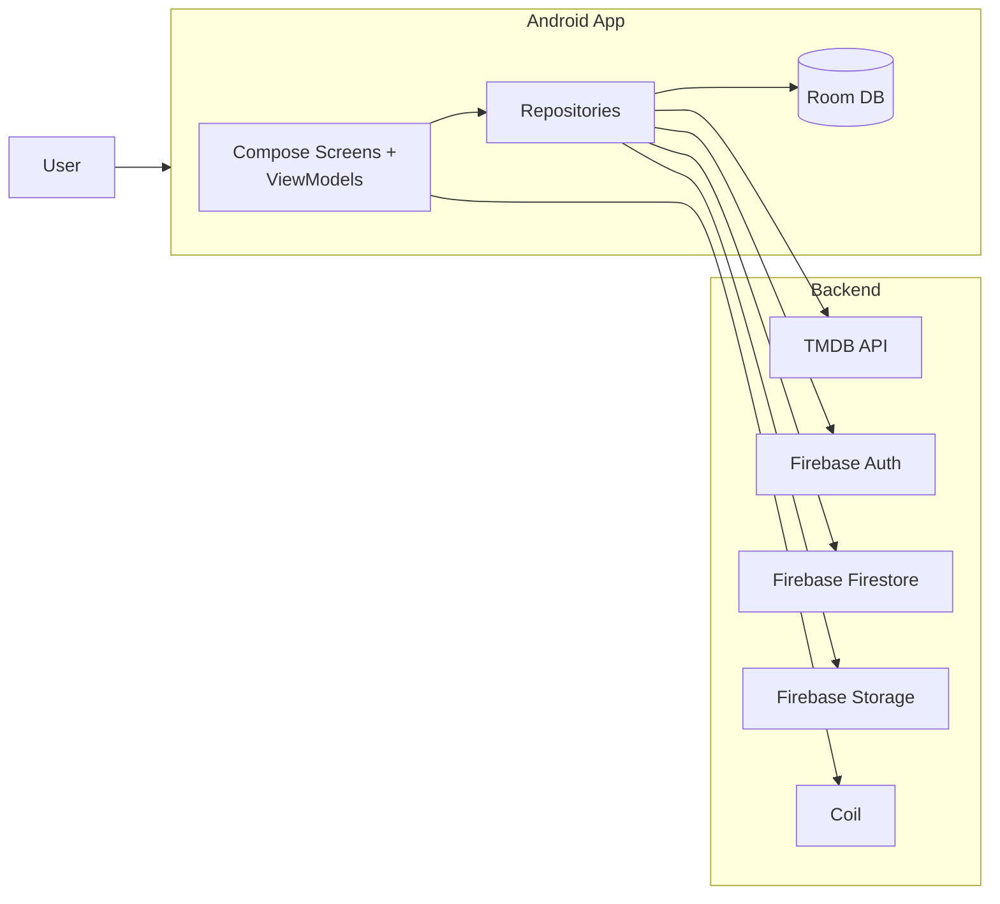
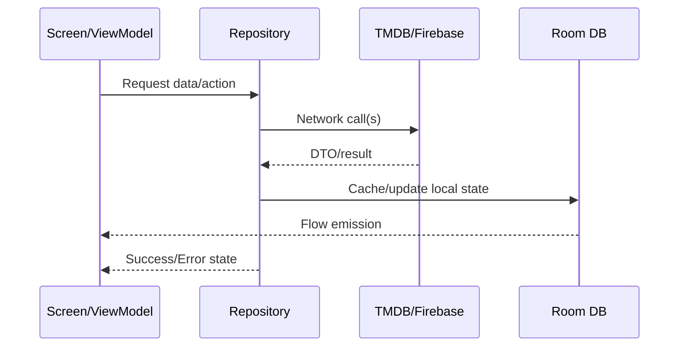
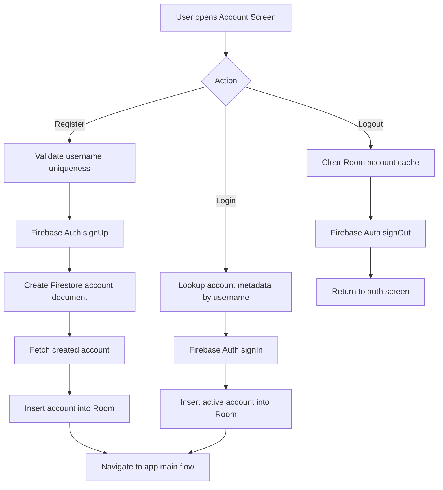
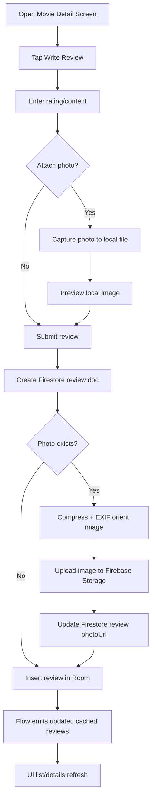

# Technical Report

## 1. Summary
Movie Review App is an Android application for movie discovery, review authoring, and personal watchlist tracking. The app combines:
- TMDB for public movie metadata.
- Firebase (Auth/Firestore/Storage) for user identity and app-owned social data.
- Room for local caching and reactive UI updates.

The implementation follows MVVM with repositories and Hilt-based dependency injection.

## 2. Introduction
- App Name: Movie Review App
- App Version: 1.0 (`versionCode=1`, `versionName="1.0"`)
- OS Target: Android (`minSdk=26`, `targetSdk=36`, `compileSdk=36`)
- Package: `com.csd3156.mobileproject.MovieReviewApp`

Short description:
Movie Review App lets users discover movies, inspect details (trailers/providers/reviews), write personal reviews with optional photos, maintain a watchlist, and manage account/profile settings.

## 3. System Scope And Use Cases
1. Authentication and account profile
- Register/login/logout via Firebase Auth.
- Persist profile metadata (name, bio, profile image URL) in Firestore.
- Cache active account locally in Room.

2. Movie exploration
- Browse home sections (popular/trending and extended list views).
- Search/discover movies with sort and filters.
- Paginate large lists.

3. Movie details and reviews
- Open movie details, videos, providers, and aggregated review views.
- Write review with optional image capture/upload.
- View all reviews and review details pages.

4. Personal data surfaces
- Profile summary (review count/watchlist count).
- My review list.
- Watchlist management.

5. Recommendation system (planned module)
- Content-based recommendation engine scaffold exists (`recommender/Recommender.kt`).
- Intended to use user preference/review/watchlist signals to generate personalized candidate movies.
- ML-based recommendation uses cosine similarity over movie/user feature vectors.
- Not yet wired into active UI/ViewModel flow.

## 4. Technology Stack
- Kotlin, Coroutines, Flow/StateFlow
- Jetpack Compose + Material3
- MVVM + Repository pattern
- Hilt DI
- Retrofit + OkHttp + Moshi
- Room
- Firebase Auth + Firestore + Storage
- Coil 3, ExifInterface, uCrop
- Android YouTube Player

## 5. Dependency Inventory (from Gradle)
### Core Android
- `androidx.core:core-ktx:1.17.0`
- `androidx.appcompat:appcompat:1.7.1`
- `androidx.lifecycle:lifecycle-runtime-ktx:2.10.0`
- `androidx.activity:activity-compose:1.12.4`

### UI and Navigation
- Compose BOM `androidx.compose:compose-bom:2026.02.00`
- `androidx.compose.material3:material3:1.5.0-alpha14`
- `androidx.navigation:navigation-compose:2.9.7`
- `androidx.hilt:hilt-navigation-compose:1.3.0`

### Dependency Injection
- `com.google.dagger:hilt-android:2.59.1`
- `com.google.dagger:hilt-android-compiler:2.59.1` (KSP)

### Networking and Serialization
- `com.squareup.retrofit2:retrofit:3.0.0`
- `com.squareup.retrofit2:converter-moshi:3.0.0`
- `com.squareup.okhttp3:logging-interceptor:5.3.2`
- `com.squareup.moshi:moshi-kotlin:1.15.2`
- `org.jetbrains.kotlinx:kotlinx-coroutines-android:1.10.2`

### Local Persistence
- `androidx.room:room-runtime:2.8.4`
- `androidx.room:room-ktx:2.8.4`
- `androidx.room:room-compiler:2.8.4` (KSP)
- `androidx.room:room-paging:2.8.4`

### Media / Images
- `io.coil-kt.coil3:coil-compose:3.3.0`
- `io.coil-kt.coil3:coil-network-okhttp:3.3.0`
- `androidx.exifinterface:exifinterface:1.4.2`
- `com.github.yalantis:ucrop:2.2.11`
- `com.pierfrancescosoffritti.androidyoutubeplayer:core:13.0.0`

### Backend
- Firebase BOM `com.google.firebase:firebase-bom:34.9.0`
- `com.google.firebase:firebase-auth`
- `com.google.firebase:firebase-firestore`
- `com.google.firebase:firebase-storage`

### Security / Utility
- `at.favre.lib:bcrypt:0.10.2`

## 6. Architecture Overview
### 6.1 Layered Design
- UI layer: Compose screens + ViewModels.
- Domain layer: domain models and repository interfaces.
- Data layer: repository implementations coordinating local/remote data.
- Infrastructure: DI modules for network/firebase/database wiring.

### 6.2 Container Diagram


### 6.3 Runtime Data Paths


## 7. Project Structure Guide
| Layer / Concern | Primary Path(s) | What belongs here |
|---|---|---|
| UI | `ui/**` | Compose screens, feature UI state, ViewModels, UI-only helpers/components |
| Domain | `domain/model`, `domain/repository` | Pure business/domain models and repository interfaces (platform-agnostic contracts) |
| Data Repositories | `data/repository/**` | Concrete repository implementations coordinating local + remote sources |
| Remote Integrations | `data/remote/api`, `data/remote/dto` | TMDB/Firebase service wrappers, request/response DTOs, mapping boundaries |
| Local Persistence | `data/local/**`, `data/local/database/**` | Room DB, entities, DAOs, converters, local-cache contracts |
| Dependency Injection | `data/di/**` | Hilt modules for Retrofit/OkHttp, Firebase, Room, repositories, dispatchers |
| App Bootstrap | `application/**` | `@HiltAndroidApp` and app-wide initialization |
| App Shell / Navigation | `MainActivity.kt` | Root navigation host + top-level app shell wiring |

Placement rules used in this project:
1. UI files should not directly call Firebase/TMDB SDKs; use ViewModel -> Repository.
2. Repository interfaces stay in `domain`, implementations stay in `data`.
3. DTO changes are isolated to `data/remote/dto` and mapped before reaching UI.
4. Room entities/DAOs remain in local data layer and are exposed via repository flows.

## 8. MVVM Coverage By Feature

### 8.1 Screen to ViewModel to Data Mapping
| Feature Area | Primary Screens | ViewModel(s) | Repository / Services | Data Sources |
|---|---|---|---|---|
| App root/navigation | `MainActivity` flows | `AppViewModel` | N/A | In-memory UI state |
| Home sections | `HomeScreen`, `MovieExtendedList` | `HomeScreenViewModel`, `MovieExtendedListViewModel` | `MovieRepository` | TMDB |
| Movie details + write review | `MovieDetailScreen` | `MovieListViewModel` (current shared VM) | `MovieRepository`, `ReviewRepository`, `WatchlistRepository` | TMDB + Room + Firebase |
| Reviews pages | `MovieReviewsScreen`, `ReviewDetailsScreen`, `ReviewList` | `MovieReviewsViewModel`, `ReviewDetailsViewModel`, `ReviewListViewModel` | `MovieRepository`, `ReviewRepository` | TMDB + Room + Firestore |
| Search/Browse | `BrowseScreen` | `browseMovieViewModel` | `MovieRepository` | TMDB |
| Watchlist | `WatchlistScreen` | `WatchlistViewModel` | `WatchlistRepository`, `WatchlistFirestoreService` | Room + Firestore |
| Account auth | `AccountScreen` | `AccountViewModel` | `AccountRepository`, `FirebaseAuthService`, `AccountFirestoreService` | Firebase + Room |
| Profile + settings | `ProfileScreen`, `AccountSettings` | `ProfileViewModel`, `AccountSettingViewModel` | `AccountRepository`, `ReviewRepository`, `WatchlistRepository`, `ProfileStorageService` | Room + Firestore + Storage |
| Recommendations (planned) | future home/profile recommendation surfaces | future `RecommendationViewModel` | `Recommender` + `MovieRepository` (+ optional local signal repositories) | Room/Firestore user signals + TMDB candidates |

### 8.2 Per-Feature Responsibility Notes
1. Auth and account
- ViewModels orchestrate login/register/update actions.
- Repository handles Firebase auth + Firestore metadata + Room active-account cache.

2. Movie listing and discovery
- ViewModels manage query/filter/pagination state.
- `MovieRepositoryImpl` maps TMDB DTOs into domain models with unified error/loading semantics.

3. Movie details and review submission
- Details screen currently reuses `MovieListViewModel` (not a dedicated detail VM yet).
- Review submission pipeline: create Firestore doc -> optional Storage upload -> update photo URL -> cache in Room.

4. Reviews aggregation and details
- All-reviews screens combine remote TMDB reviews with app-local reviews.
- Review detail first checks local cache identity before remote fallback where applicable.

5. Profile and media
- Profile photo updates support crop flow in settings and compressed upload.
- Missing profile URL paths use fallback initial avatar rendering in UI.

### 8.3 Detailed Implementation By Feature
1. Authentication (`AccountViewModel` + `AccountRepository`)
- Register flow:
  - checks username uniqueness via Firestore metadata lookup,
  - creates Firebase Auth user,
  - creates Firestore account document,
  - hydrates Room active account cache.
- Login flow:
  - finds account metadata by username,
  - signs in via Firebase Auth,
  - writes account into Room.
- Logout flow clears local account cache then signs out auth session.
- Design impact: local cache enables immediate UI continuity after auth transitions.

2. Home and section pagination (`HomeScreenViewModel`, `MovieExtendedListViewModel`)
- Maintains independent page cursors and end flags for popular/trending/discover.
- Uses dedup by movie id when appending pages to avoid duplicates during partial refresh/reload.
- Home refresh resets all section pagination states, then triggers first page loads.
- Extended-list screen isolates pagination state per section for simpler UX and lower coupling.

3. Movie details + write review (`MovieDetailScreen` + `MovieListViewModel`)
- Current architecture uses shared `MovieListViewModel` for detail data and review submission state.
- Pulls details, videos, providers, and remote TMDB reviews.
- Separately observes cached local reviews via Room stream.
- Review draft/media:
  - stores `pendingCapturePath` and `reviewPhotoPath` in VM state,
  - handles camera success/failure cleanup,
  - tracks submit loading/error (`isSubmittingReview`, `reviewSubmitError`).
- Review submit calls `ReviewRepository.addReview(...)` and updates UI status for uploading/saving.

4. Review surfaces (`MovieReviewsViewModel`, `ReviewDetailsViewModel`, `ReviewListViewModel`)
- Movie all-reviews screen:
  - keeps separate `localReviews` and `remoteReviews`,
  - supports pull-to-refresh and page-based remote loading,
  - deduplicates incoming remote pages by review id.
- Review details screen:
  - checks local cache first for target review id,
  - avoids remote fetch for `local-*` ids when missing,
  - otherwise fetches TMDB page and resolves review by id.
- User review list screen:
  - displays cached user reviews from Room,
  - refresh operation resyncs user reviews from Firestore into Room.

5. Search/Browse (`browseMovieViewModel`)
- Supports two paged data modes:
  - search mode (query present),
  - discover mode (query empty with sort/filter params).
- Persists last discover filter set (`DiscoverParams`) so “load next” uses consistent criteria.
- Tracks independent pagination progress and end-of-list flags for search and discover.

6. Watchlist (`WatchlistViewModel`)
- Uses reactive stream for saved state and full watchlist list.
- `toggle(movie, isCurrentlySaved)` delegates add/remove operations to repository.
- Repository sync pattern combines local Room watchlist with Firestore-backed persistence.

7. Profile and settings (`ProfileViewModel`, `AccountSettingViewModel`)
- Profile screen aggregates account info + review count + watchlist count.
- Settings view model owns draft profile photo lifecycle:
  - pending capture path,
  - draft photo path,
  - remove-photo intent,
  - save loading/error state.
- On save, repository handles compress/upload/update and then refreshes local account cache.

### 8.4 Recommendation System Placement And Design
Recommendation feature design:
1. Add `RecommendationViewModel` in `ui/main` or `ui/recommendations`.
2. Add `RecommendationRepository` (or add use-case layer) to orchestrate:
- user signal collection (reviews/watchlist/history from Room/Firestore),
- candidate retrieval from TMDB,
- scoring/ranking (content-based).
3. Expose paged recommendation state to home/profile sections.
4. Cache recommendation snapshots locally for faster repeat loads.

Planned model approach:
- Build feature vectors for movies (genres, vote stats, optional overview embeddings/keywords).
- Build user preference vector from watched/saved/rated movies with stronger weight for higher ratings.
- Compute cosine similarity between user vector and candidate movie vectors.
- Rank top-N results, apply diversity/repetition penalties, then publish to UI.

Proposed scoring signals (content-based):
- genre overlap with high-rated user reviews,
- vote-average and vote-count weighting thresholds,
- recency bias and diversity penalty (to avoid near-duplicates).

Recommended report location:
- keep this in MVVM feature mapping + a dedicated subsection (this one) until productionized.

## 9. Database Design (Room)
Database: `MovieReviewDatabase` (version 9), configured with `fallbackToDestructiveMigration(true)`.

### 9.1 Schema Tables

#### `accounts`
| Column | Type | Nullable | Key | Notes |
|---|---|---|---|---|
| `id` | `Long` | No | PK (auto-generate) | Local row identifier |
| `uid` | `String` | No | - | Firebase user id |
| `email` | `String` | No | - | User login/contact email |
| `username` | `String` | No | - | Public/app username |
| `name` | `String` | Yes | - | Display name |
| `profileUrl` | `String` | Yes | - | Cloud profile image URL |
| `bio` | `String` | Yes | - | User bio text |
| `createdAt` | `Date` | No | - | Account creation timestamp |
| `updatedAt` | `Date` | No | - | Last update timestamp |

#### `movie_reviews`
| Column | Type | Nullable | Key | Notes |
|---|---|---|---|---|
| `id` | `Long` | No | PK (auto-generate) | Local row identifier |
| `movieId` | `Long` | No | - | Related TMDB movie id |
| `author` | `String` | No | - | Display author name |
| `content` | `String` | No | - | Review text |
| `rating` | `Double` | Yes | - | User rating value |
| `createdAtMillis` | `Long` | No | - | Review creation time (epoch ms) |
| `photoPath` | `String` | Yes | - | Local path or cloud URL (depending on stage/source) |
| `reviewId` | `String` | Yes | - | Remote review document id |
| `userId` | `String` | Yes | - | Review author uid |
| `movieTitle` | `String` | Yes | - | Cached movie title |

#### `watchlist_movies`
| Column | Type | Nullable | Key | Notes |
|---|---|---|---|---|
| `movieId` | `Long` | No | PK | TMDB movie id |
| `title` | `String` | No | - | Movie title |
| `posterUrl` | `String` | No | - | Poster image URL |
| `releaseDate` | `String` | No | - | Release date text |
| `rating` | `Double` | No | - | Movie rating snapshot |
| `savedAt` | `Long` | No | - | Time when saved to watchlist |
| `firstGenres` | `String` | Yes | - | Primary genre label cache |

DAOs:
- `AccountDAO`
- `ReviewDao`
- `WatchlistDao`

How Room is used:
- Local-first rendering for account/review/watchlist surfaces.
- `Flow` observers keep Compose UI updated automatically after inserts/deletes/refresh.
- Repository layer controls when remote snapshots are persisted.

## 10. Remote Integrations
### TMDB
- Consumed via Retrofit service (`TmdbApiService`) with auth header injected by OkHttp.
- Used for movie lists, search/discover, movie details, providers, videos, and TMDB reviews.

### Firebase
- Auth: session and identity lifecycle.
- Firestore: account docs, review docs, watchlist docs.
- Storage: profile image binaries and review image binaries.

## 11. Key End-to-End Data Flows
1. Movie details load
- Screen triggers details/videos/providers/reviews load.
- Repository fetches remote TMDB data.
- Local app reviews are observed from Room and merged at UI layer.

2. Add review with photo
- Capture local file path -> compress/orient -> upload to Storage.
- Update Firestore review doc with cloud URL.
- Persist finalized review in Room for immediate local rendering.

3. Update profile photo
- Capture + crop -> compress -> upload Storage -> update Firestore profile URL.
- Refresh Room account cache -> Home/Profile displays updated image via Coil.

### 11.1 Account Flow Chart


### 11.2 Movie Review Flow Chart


## 12. Code Snippets And Walkthrough

### 12.1 Auth registration and local sync
```kotlin
suspend fun registerAccount(email: String?, username: String, password: String, name: String? = null): RequestResult<String?> {
    val remoteAccount = findAccountByRemoteUser(username)
    if (remoteAccount != null) throw Exception("Username already exists")

    accountDao.deleteAll()
    val uid = firebaseAuthService.signUp(email ?: "${username}@moviereviewapp.default", password) {
        accountFirestoreService
    }

    val createRequestAccount = CreateAccountDto(uid = uid, email = email, username = username, name = name)
    when (val result = accountFirestoreService.createAccount(createRequestAccount)) {
        is RequestResult.Success -> {
            val accountDto = accountFirestoreService.getAccount(uid) ?: throw Exception("Unable to create account")
            accountDao.insert(accountDto.toDomain().toRoomEntity())
            return RequestResult.Success(null, uid)
        }
        is RequestResult.Error -> throw Exception(result.message)
    }
}
```
Why it matters:
- Keeps auth state and local app cache consistent after signup.

### 12.2 Review media pipeline
```kotlin
val reviewResult = reviewFirestoreService.createReview(movieId.toInt(), createDtoObj)
if (reviewResult is RequestResult.Success && !photoPath.isNullOrEmpty()) {
    val cloudData = localToCompressJPEG(photoPath) ?: throw Exception("Failed to compress image")
    val uploadResult = reviewCloudStoreService.uploadImage(userId, reviewResult.data, cloudData)
    if (uploadResult is RequestResult.Success) {
        reviewFirestoreService.updateReview(
            movieId.toInt(),
            reviewResult.data,
            ReviewFirebaseUpdateDto(photoUrl = uploadResult.data)
        )
    }
}
```
Why it matters:
- Decouples document creation from binary upload and minimizes payload size.

### 12.3 TMDB repository flow state
```kotlin
override fun getPopularMovies(page: Int): Flow<Resource<List<Movie>>> = flow {
    emit(Resource.Loading)
    val response = apiService.getPopularMovies(page = page)
    emit(Resource.Success(response.results.map { it.toDomain() }))
}.catch { throwable ->
    emit(Resource.Error(message = throwable.message ?: "Unable to load movies", throwable = throwable))
}.flowOn(ioDispatcher)
```
Why it matters:
- Standardized loading/success/error states simplify UI behavior.

### 12.4 Room reactive contract
```kotlin
@Query("SELECT * FROM movie_reviews WHERE movieId = :movieId ORDER BY createdAtMillis DESC")
fun observeMovieReviews(movieId: Long): Flow<List<ReviewEntity>>
```
Why it matters:
- Auto-refreshes the review UI whenever cached rows change.

## 13. Quality Attributes
- Performance: image compression and EXIF correction reduce upload size and display issues.
- Reliability: staged remote operations improve consistency but still rely on network quality.
- Security: token-based TMDB auth and Firebase-authenticated app operations.
- UX responsiveness: Room + Flow keeps UI fast even with intermittent remote latency.

## 14. References
1. Movie Review Android App (this project source and implementation).
2. Android Developers. Guide to app architecture: https://developer.android.com/jetpack/guide
3. Android Developers. Recommendations for Android architecture: https://developer.android.com/topic/architecture/recommendations
4. Android Developers. Compose UI architecture: https://developer.android.com/develop/ui/compose/architecture
5. Android Developers. ViewModel API reference: https://developer.android.com/reference/androidx/lifecycle/ViewModel
6. Android Developers. Dependency injection with Hilt: https://developer.android.com/training/dependency-injection/hilt-android
7. Android Developers. Save data in a local database using Room: https://developer.android.com/training/data-storage/room
8. Firebase. Get started with Firebase Authentication on Android: https://firebase.google.com/docs/auth/android/start
9. Firebase. Add data to Cloud Firestore: https://firebase.google.com/docs/firestore/manage-data/add-data
10. Firebase. Get data with Cloud Firestore: https://firebase.google.com/docs/firestore/query-data/get-data
11. Firebase. Upload files with Cloud Storage on Android: https://firebase.google.com/docs/storage/android/upload-files
12. TMDB Developer Docs. Getting Started: https://developer.themoviedb.org/docs/getting-started
13. TMDB Developer Docs. FAQ: https://developer.themoviedb.org/docs/faq
14. Coil Documentation. Network Images: https://coil-kt.github.io/coil/network/
15. Coil (GitHub). Project repository: https://github.com/coil-kt/coil
16. scikit-learn documentation. `cosine_similarity`: https://scikit-learn.org/1.1/modules/generated/sklearn.metrics.pairwise.cosine_similarity.html
